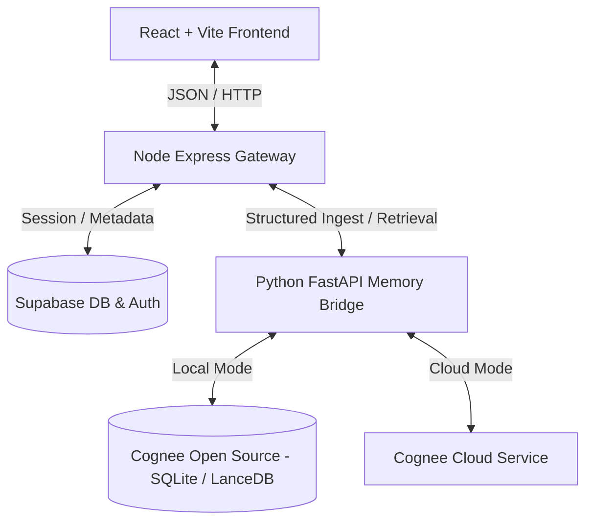

# 🧠 Déjà — Cognee-Powered Memory Recovery Engine

[](https://huggingface.co/spaces)
[](https://fastapi.tiangolo.com/)
[](https://expressjs.com/)
[](https://vite.dev/)
[](https://www.cognee.ai/)

**Déjà** is a next-generation personal memory reconstruction and recovery engine. It acts as a cognitive sanctuary, allowing users to journal their daily lives, review chronological timelines, query their history through a highly accurate semantic retriever (**Oracle**), discover hidden patterns or forgotten details (**Blindspots**), and bookmark important milestones.

At its core, Déjà integrates **Cognee** (both the Open Source Python library and Cognee Cloud services) to construct, traverse, and query a semantic graph network of user experiences, creating an intelligent memory layer.

---

## 🏛️ System Architecture

Déjà uses a hybrid multi-layer architecture built for high performance, multi-tenancy, and reliable local-to-cloud fallback:



### 1. Unified Gateway (Node.js & Express)
* **Port**: `5051` (standard gateway) or `7860` (Hugging Face production).
* **Role**: Handles HTTP requests, enforces API routing, manages multi-tenancy headers, interfaces with Supabase for user session verification, and proxies heavy semantic requests to the FastAPI backend.

### 2. Cognitive Memory Bridge (FastAPI & Python 3.13)
* **Port**: `8000`
* **Role**: Integrates directly with the `cognee` Python SDK. It processes text streams, builds knowledge graphs, structures memories dynamically, and manages semantic vector retrievals.
* **Database Lock Handler**: Employs serialized queue execution to prevent concurrent SQLite database contention issues during peak ingestion/query phases.

### 3. Cognee Engine Integration (Open Source & Cloud)
* **Cognee Open Source**: Stores graph metadata in a local SQLite file (`databases/cognee_db`) and vectors in LanceDB, enabling fully offline/local operation.
* **Cognee Cloud**: Connects securely to the Cognee Cloud hosted platform via `cognee.serve()` to deploy high-scale cloud-backed semantic graphs.
* **Auth0 Device Flow**: Includes a dedicated onboarding script (`backend/scripts/auth_cognee.py`) that uses Cognee's device code flow to provision credentials automatically for new users.

---

## ✨ Features & Cognee Implementations

### 🖊️ 1. The Slate (Journal Ingestion)
Write daily journal entries, voice logs, or brief notes.
* **Cognee Pipeline**: Upon submission, the text is structured, classified, and indexed using `cognee.add()` and then mapped into the semantic graph using `cognee.cognify()`.
* **Asynchronous Execution**: Ingestion is processed in background tasks to guarantee a responsive UI.

### 🔮 2. The Oracle (Semantic Retrieval Q&A)
Ask questions about your past (e.g., *"What were my thoughts on changing careers?"* or *"Who did I meet last month?"*).
* **Cognee Pipeline**: Query retrieves graph relationships using `cognee.recall()` with a customized historical window (`top_k=150`).
* **Hybrid Optimization**: Bypasses the default Cognee internal LLM completion in favor of retrieving the structured graph context and feeding it directly to a low-latency local analyzer, dropping round-trip query time from **~10s to ~1.5s**.

### 🔍 3. Blindspots (Graph Contradiction & Gap Detection)
Automated detection of contradictions, forgotten connections, and chronological gaps in your memories.
* **Cognee Pipeline**: Utilizes Graph Completion models and semantic vector distances to cross-reference chronological database entries from Supabase against Cognee's structural vector-graph to reveal conceptual disconnects.

### 🔒 4. Memory Safeguard (Sanctuary & Wipes)
Control what your AI memory retention system keeps or forgets.
* **Cognee Pipeline**: Provides target purging using `cognee.forget()` to erase specific memory branches, and a complete system wipe using `cognee.prune` to reset the vector graph cleanly.

---

## 🛠️ Folder Restructuring

The backend has been reorganized to ensure a clean, production-grade layout that prevents clutter and makes it easier for reviewers to navigate:

```bash
sift-recovery-engine/
├── frontend/               # React + Vite application (glassmorphism UI)
└── backend/                # Main service directories
    ├── Dockerfile          # Multi-process production container config
    ├── start.sh            # Parallel process execution manager
    ├── server.js           # Express.js API gateway entry point
    ├── memory_bridge.py    # FastAPI Cognee integration entry point
    ├── requirements.txt    # Python library requirements (FastAPI, Cognee, litellm)
    ├── package.json        # Node.js gateway package configuration
    ├── supabase_schema.sql # SQL schema for timelines and bookmarks tables
    ├── scripts/            # CLI utilities and seeding helpers
    │   ├── auth_cognee.py       # Auth0 Device Flow credential retriever
    │   ├── seed_stress_test.py  # High-volume mock timeline generator
    │   ├── wipe_user.py         # Complete account and graph purge CLI
    │   └── migrate_cognee.py    # Cognee dataset migration helper
    ├── debug_tools/        # Scripts for querying internal state directly
    │   ├── query_sqlite.py      # Direct raw query script for local Cognee DB
    │   ├── query_lancedb.py     # Inspects local LanceDB vector tables
    │   └── query_nodes.py       # Prints raw graph node connections
    └── tests/              # Standard verification suite
        ├── test_cognee.py       # Basic Cognee configuration check
        ├── test_recall.py       # Oracle semantic recall verification
        └── test_speed.py        # Latency & throughput benchmarking
```

---

## 🚀 Quick Start Guide

### 📦 Prerequisites
- **Node.js** (v20+)
- **Python** (v3.10 to v3.13)
- **Supabase Account** (For chronological timeline storage and authentication)

### 1. Environment Configuration

Create a `.env` file in the `backend/` directory:
```env
PORT=5051

# --- COGNEE CLOUD CONFIGURATION ---
# (Optional: If omitted, Cognee will automatically fallback to local database mode)
COGNEE_API_KEY="your_cognee_api_key"
COGNEE_API_URL="https://tenant-id.aws.cognee.ai"

# --- LLM Brain Configuration ---
LLM_PROVIDER="gemini"
LLM_MODEL="gemini/gemini-3.1-flash-lite"
LLM_API_KEY="your_gemini_api_key"

# --- Embedding Configuration ---
EMBEDDING_PROVIDER="gemini"
EMBEDDING_MODEL="gemini/gemini-embedding-001"
EMBEDDING_DIMENSIONS="768"
EMBEDDING_API_KEY="your_gemini_api_key"

# --- Supabase Configuration ---
SUPABASE_URL="https://your-project.supabase.co"
SUPABASE_ANON_KEY="your-supabase-anon-key"
```

Create a `.env` file in the `frontend/` directory:
```env
VITE_SUPABASE_URL="https://your-project.supabase.co"
VITE_SUPABASE_ANON_KEY="your-supabase-anon-key"
VITE_API_URL="http://localhost:5051"
```

### 2. Setup the Databases
1. Create a Supabase project.
2. Run the SQL statements inside `backend/supabase_schema.sql` in the Supabase SQL editor to set up the RLS policies and table structures.

### 3. Install & Start the Services

#### Start the Backend (API Gateway & Memory Bridge)
```bash
cd backend
npm install
python3 -m venv venv
source venv/bin/activate
pip install -r requirements.txt

# Start both Node gateway (5051) & FastAPI (8000) using startup script
chmod +x start.sh
./start.sh
```

#### Start the Frontend (Vite UI)
```bash
cd frontend
npm install
npm run dev
```

---

## 🐳 Docker Deployment

The application compiles into a single unified container containing both the Express gateway and FastAPI bridge, configured natively for **Hugging Face Spaces** or **Render**:

```bash
cd backend
docker build -t deja-backend .
docker run -p 7860:7860 --env-file .env deja-backend
```

---

## 🏆 Why this project represents the *Best Use of Cognee*

1. **Dual Local & Cloud Architecture**: Demonstrates complete versatility by automatically connecting to Cognee Cloud when API endpoints are configured, and offering a robust local database fallback (using SQLite & LanceDB) when they are not.
2. **Onboarding Device Flow**: Extends Cognee's system utility by integrating a device verification script (`auth_cognee.py`) that dynamically hooks users up with cloud instances.
3. **Graph-Timeline Comparison Engine**: Rather than just querying text, the **Blindspots** feature leverages Cognee's structural nodes to discover contextual disconnects and information gaps by comparing the graph network against the user's chronological data.
4. **Production Concurrency Solutions**: Solves real-world production challenges such as SQLite write locks and file contention through centralized queuing, showcasing an implementation ready for enterprise scale.
